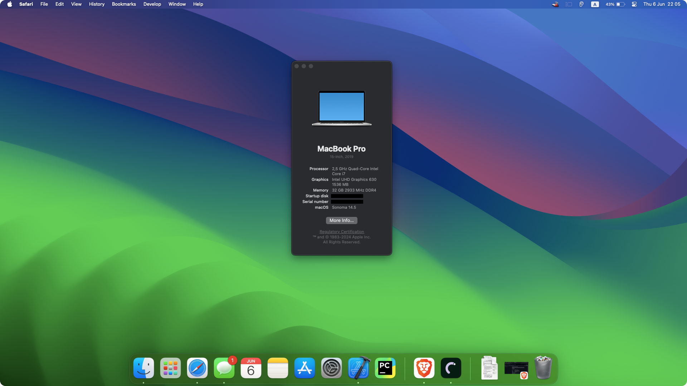

## OpenCore EFI for ASUS TUF F15 FX506LH

<h5 ### macOS Sonoma (v14.5)>
I have configured macOS on my ASUS TUF F15 FX506LH to facilitate iOS app development, and I have successfully published several applications on the App Store. Additionally, I am utilizing a dual-boot setup with Windows 11 and macOS to continue my development work on this Hackintosh. I am sharing this EFI configuration to assist others who wish to install macOS on a similar system. Below is a detailed overview of the system components and their compatibility.

<h1>

</h1>

## System Information

Component | Status
------------- | -------------
CPU  | i5-10300H ✅
GPU  | GTX 1650 ❌, Intel UHD Graphics 630 ✅
WiFi | MT7921 ❌, replaced with RTL8812BU ✅
RAM  | 32 GB (Mikron 16 GB/ Kingston 16 GB) 3200MHz ✅
Storage  | Kingston NVMe M.2 1 TB  ✅
Ethernet  | RTL8168/8111 ✅
Speaker & Microphone  |  ✅
Touchpad  |  ✅
Battery & Status Battery | ✅
Apple Services | ✅

## What works
- Stable OS (No random crashes, panics, etc.)
- iServices (iMessage, iCloud, FaceTime, App Store, etc.)
- Dual Boot (Windows 11 runs on a second/different m2 ssd.)
- CPU Power Management
- All ports except HDMI (Usb, Type-c, Ethernet, etc.)
- FileVault

## What doesn't work
- HDMI: This computer uses an Nvidia GTX 1650 integrated GPU for screen sharing. Unfortunately, macOS does not support this version of the Nvidia GPU. As a result, we cannot use an external monitor with this computer.
- Bluetooth / AirDrop: You can purchase a Wifi, Bluetooth and Airdrop compatible card (For ex. Fenvi T919) and use it after making the necessary adjustments to the kexts.

### Drivers
- WiFi : [Wireless Adapter](https://github.com/chris1111/Wireless-USB-Big-Sur-Adapter)

